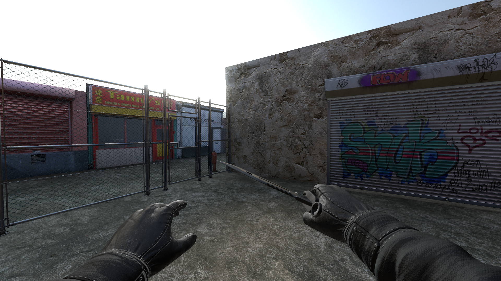
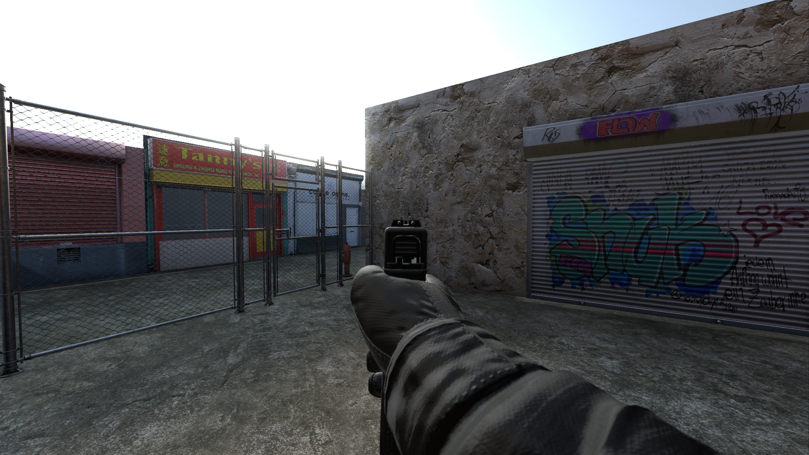
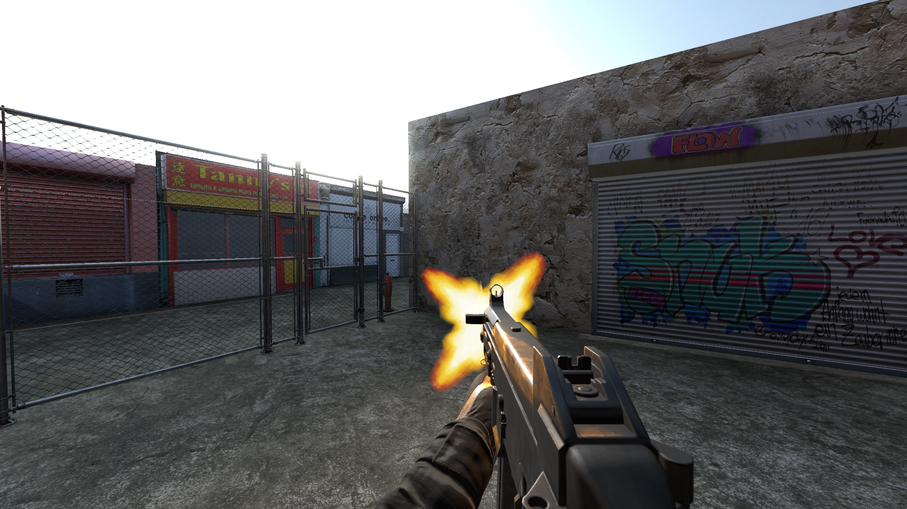
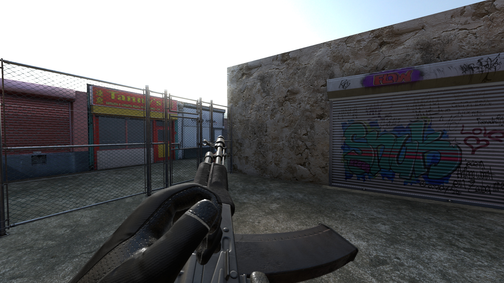
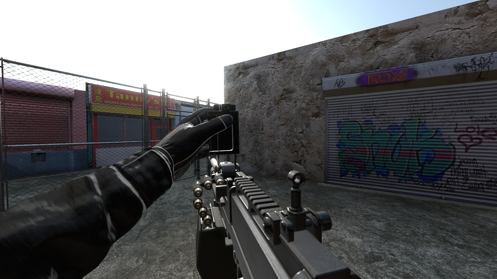
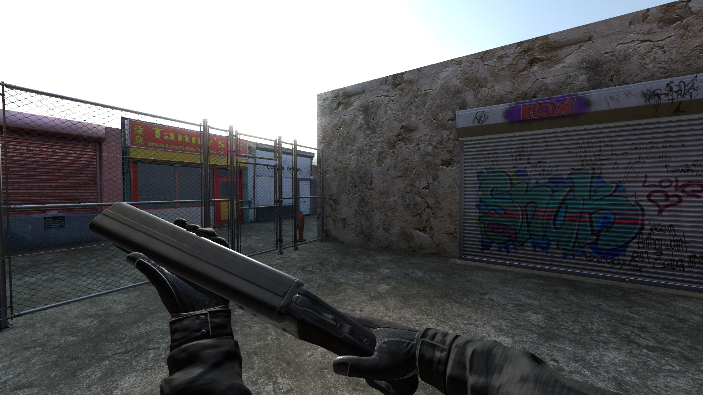
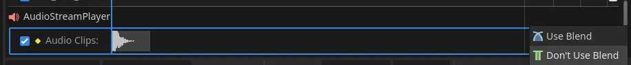

# FPS Hands

Plug and play hands for FPS with animated weapons.  
Weapon models are fictional.

[GPLv3](LICENSE)

## Features

- 6 animated weapons
- Animation sounds
- Give damage (emit a signal)
- Damage based on distance
- Melee
- Aim down sights
- Zoom on aim down sights
- Bullet hole
- Avoid clipping
- Sway
- Recoil
- Camera shake
- Left handed mode
- Realistic reloading mode
- Physical bullets
- Shotgun spread
- Optional auto reload
- Optional hold breath while ads

## To-Do

- Different bullet holes
- Drop bullet's shells
- Hide bullets inside magazine if needed

## Screenshots

| | |
|-|-|
|  |  |
|  |  |
|  |  |

## Inner Working

### Weapons

Weapons are packed scenes stored in "weapons" array.  
To add weapons, add packed scene to this array.

Weapons proprieties are stored inside weapon's scene metadata.  
These are:

| Name           | Type    | Description                        |
| -------------- | ------- | ---------------------------------- |
| [ads_pos]      | Vector3 | Aim down sights position           |
| [max_magazine] | int     | Magazine size, 0 if no megazine    |
| [auto]         | bool    | Automatic fire                     |
| [melee]        | bool    | Wheter it's a melee weapon         |
| [delta]        | float   | Aiming speed                       |
| damage         | float   | Damage points                      |
| range          | float   | Distance at which can hit          |
| [recoil_x]     | float   | Vertical recoil                    |
| [recoil_y]     | float   | Horizontal recoil                  |
| [ammo_type]    | String  | Ammo type name (see inventory)     |
| [spread]       | float   | Bullets precision                  |
| [bullet_count] | int     | Number of bullets to shot at a time|

(Those inside brackets are optional)

### Inventory

Inventory is a dictionary composed as follows:

```
{
	"weapons" : Array = [ # Array of arrays
		[0, -1], # This is a weapon inside inventory.
		         # First value is id of weapon (see weapons var)
		         # Second is ammo inside (-1 for full)
	],
	"ammo" : Dictionary = {
		"none" = 0, # This is for weapons without ammo
		"9mm" = 0,  # Obviously all values are int
		...
	}
}
```

## Known Issues

### Audio Blend

Inside AnimationPlayer, in the weapon's scene, under "AudioStreamPlayer" the "Audio Clips" must have "Don't Use Blend".

This setting for some reason is not kept when importing plugin or moving from a project to another, so it must be set manually every time the addon is imported.



### Automatic Fire Framerate Dependant

With fewer fps,	automatic fire is slower.  
Moving automatic fire code from \_process to \_physics_process does not solve the issue.

### Weapon Shake Scale Dependant

If FpsHands node's scale is too small, weapons will shake much more.  
A shader can be used instead, like [this one](https://godotshaders.com/shader/screen-shake/).

## Credits

- Weapons models and animations by [DJMaesen](https://sketchfab.com/bumstrum) under [CC BY 4.0](https://creativecommons.org/licenses/by/4.0/)
- Bullethole texture by [musdasch](https://opengameart.org/users/musdasch) under [CC0 1.0](https://creativecommons.org/publicdomain/zero/1.0/)
- Muzzle flash texture by [Julius](https://opengameart.org/users/julius) under [CC BY-SA 3.0](https://creativecommons.org/licenses/by-sa/3.0/)
- Muzzle smoke texture by [Kenney](https://www.kenney.nl/) under [CC0 1.0](https://creativecommons.org/publicdomain/zero/1.0/)
- Icon by [game-icons.net](https://game-icons.net/) under [CC BY 3.0](https://creativecommons.org/licenses/by/3.0/)
